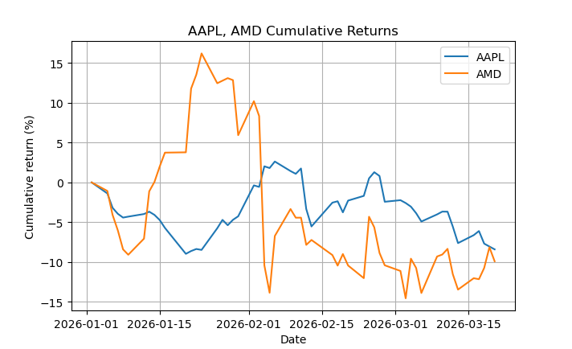

# yf.py

Query Yahoo Finance data and plot overlays of stock ticker cumulative returns.

    usage: yf.py [-h] [-y | -Y | -w | -5 | -10] ticker [ticker ...]

    positional arguments:
      ticker           Stock ticker(s)

    options:
      -h, --help       show this help message and exit
      -y, --ytd        Time range: year-to-date (default)
      -Y, --year       Time range: one year
      -w, --week       Time range: one week
      -5, --five-year  Time range: five years
      -10, --ten-year  Time range: ten years

Example:

    ./yf.py aapl amd

